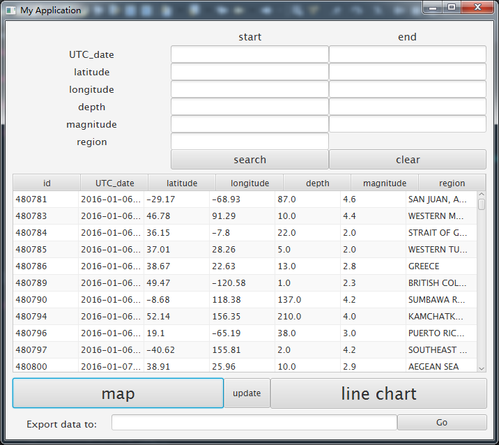
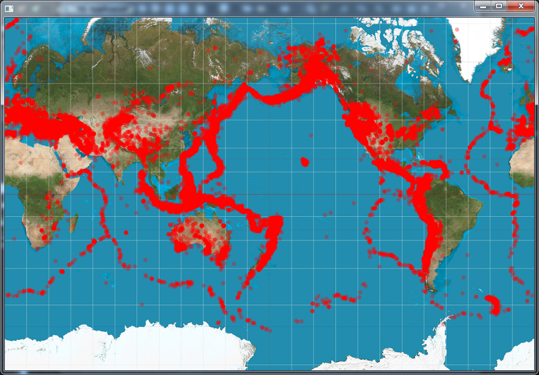
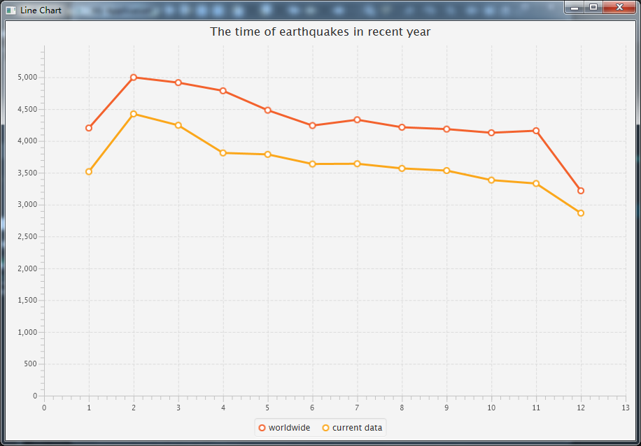
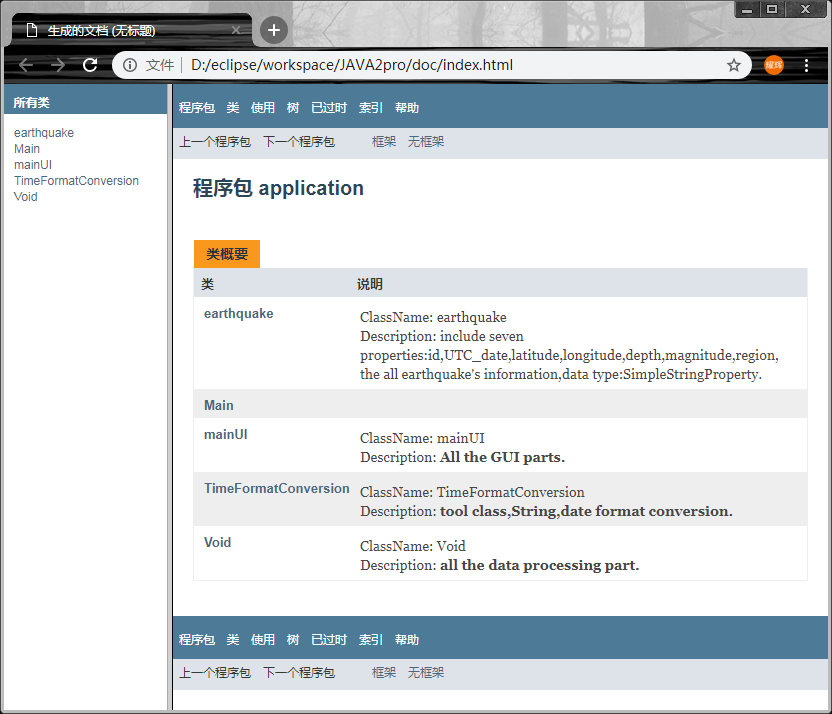

# Earthquake Information  
此项目为2017年大二课程的期末Project  

## 项目需求  
程序可以自动抓取地震信息，并将其绘制在地图上，其具有查询、更新、绘制等功能。  

## 项目成果
学习应用 `JavaFX` GUI绘制，`Jsoup` 爬虫获取信息，并编写`JavaDoc` [说明文档](/doc/)。 以及扩展Java语言的实际应用。  


 ***运行截图如下***   
1. 主要界面：   
   

2. 地震带绘制：  


3. 折线图绘制：  
  <br>  

4. doc文档：  
  <br>  
  
## 使用方法
`clone`到本地后直接Import workspace  

```
git clone https://github.com/YaohuiHan/Earthquake_information  
```
**Note:** 需要提前配置数据库，迁移数据等，建表语句如下：
```
create database java2_project;
```
以及迁移数据库：  
```
mysql -u root -p java2_project < "java2_project.sql"  
```

## 运行环境
Java: `jdk1.8.0_121`    
Jsoup: `jsoup-1.11.2.jar`  
JDBC: `mysql-connector-java-5.1.41-bin.jar`    
Mysql: `Server version: 5.7.18-log MySQL Community Server (GPL)`  


